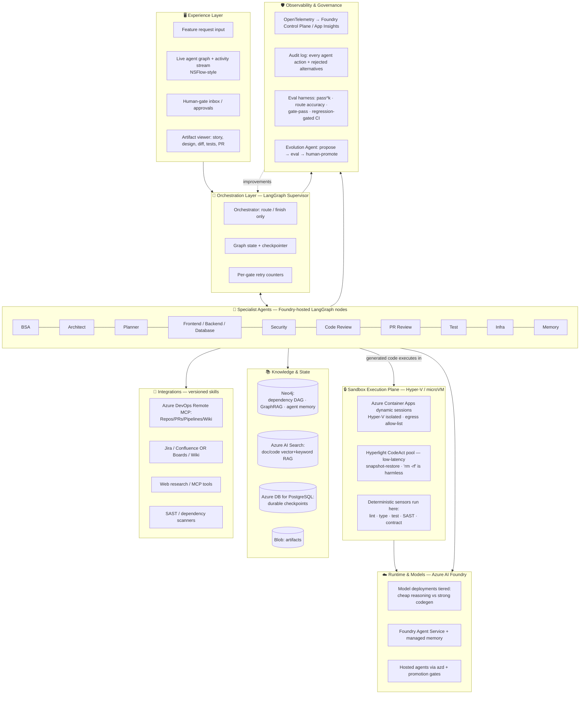
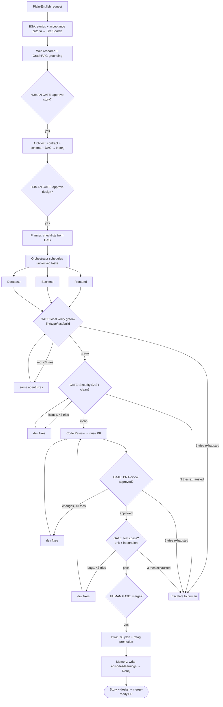

# Continuum — Agentic SDLC Pipeline
## Product Requirements Document & Reference Architecture (Enterprise POC)

| | |
|---|---|
| **Version** | 2.2 |
| **Status** | Draft for build — validated (4th research pass) |
| **Last validated** | June 2026 — code-as-harness, microVM/Hyper-V sandboxing, eval-driven trust (`pass^k`) |
| **Author role** | Senior Solution Architect |
| **One-liner** | A plain-English feature request enters; a supervisor-orchestrated swarm of specialized agents carries it through the full SDLC — story → design → code → review → test → PR — with **all agent code executing in hardware-isolated sandboxes**, **deterministic gates as contamination firewalls**, and an **eval harness that gates trust** — and a live UI shows every agent's work in real time. |
| **Core stack** | LangGraph (orchestration) + Azure AI Foundry (runtime/models/memory/governance) + Neo4j (dependency graph, GraphRAG, agent memory, shared-state substrate) + Azure AI Search (document RAG) + **Azure Container Apps dynamic sessions / Hyperlight (sandboxed code execution)** + Azure DevOps Remote MCP (repos/PRs/CI/wiki) + **eval harness (LangSmith/Braintrust)** |

---

## 0. Changelog — what changed in v2.2

This revision folds in a fourth research pass that pressure-tested the design against five sources (Microsoft Hyperlight/microVM harness, Anthropic dynamic workflows, the *Code as Agent Harness* arXiv survey, and the 2026 agent-eval literature). **The core was validated, not replaced** — these are additions:

- **(P0) Sandbox execution tier** — agent-generated code now runs *only* inside Hyper-V/microVM sandboxes (§5, §10, §12). Git-worktrees are reclassified as a *correctness* boundary, not a security one.
- **(P0) Eval harness as a first-class subsystem** — `pass^k` reliability, golden dataset, calibrated judges, block-on-regression CI (§11). This is the trust layer.
- **(P0) PEV contract model + 3-tier permission system** — the 7 rules are formalized into Plan→Execute→Verify with deterministic sensors, plus two new rules (§4.1–4.3).
- **(P1) Bounded dynamic task decomposition** as a graph node type, an **Evolution-Agent** harness-improvement loop, **deep telemetry**, and Neo4j upgraded to a **formal shared-state substrate** (§6, §9, §11).

> One research caveat carried forward: one supplied arXiv ID (`2605.28773`) resolved to an unrelated paper; the actual 2026 eval literature (PRDBench, FeatureBench, c-CRAB, Princeton HAL) was substituted. Reconfirm if a specific eval paper was intended.

---

## 1. Executive Summary

Software moves through people, and context leaks at every handoff: BSA → architect → dev → reviewer → tester. Continuum replaces the *handoffs* (not the humans) with a **harness**: a deterministic orchestration graph in which specialized AI agents do the work and **hard gates** enforce quality. A central **orchestrator (supervisor)** owns all routing and state; agents never talk to each other directly — they report back to the orchestrator, which decides the next step. This is the single most important design decision and it's what makes the system auditable, resumable, and trustworthy.

The guiding philosophy is borrowed directly from the *7 Rules* deck and made literal: **the pipeline is the product, not the LLM.** We optimize the harness — the graph, the gates, the evals, the traces — and treat the model as a swappable, tiered component.

The v2.2 design rests on three pillars the research converged on: **code is the harness** (the survey *Code as Agent Harness* formalizes exactly what the 7 rules gesture at — a Plan→Execute→Verify loop where deterministic sensors, not model confidence, decide termination); **the code is sandboxed** (every line of agent-generated code executes in a hardware-isolated microVM, because the harness "is the steering wheel, not the seatbelt and crumple zone"); and **evals gate trust** (we measure `pass^k` reliability, not just `pass@k` capability, and block any change that regresses a golden-dataset baseline).

---

## 2. Goals & Non-Goals

**Goals (POC)**
- Take one feature request → produce a Jira/Boards story, a Confluence/Wiki design, and a **merge-ready PR** in Azure DevOps with passing unit + integration tests and a clean security scan.
- Orchestrator↔agent control loop with **bounded** feedback loops (review→fix, test→fix).
- **Live agent-activity UI** + a visual dependency graph.
- Every run is **resumable** (checkpointed) and **fully traced**.
- A **learning loop**: each run writes structured knowledge back to Neo4j so the next run is better.

**Non-Goals (POC)**
- Autonomous production deploy (Infra agent *plans* IaC and the harness *retags* — humans approve promotion).
- Massive multi-feature concurrency (architected for it; demoed with 1–2).
- Model fine-tuning.

---

## 3. Why This Architecture Is the Right One

You asked for the justification, not just the diagram. Here it is.

### 3.1 Orchestration: LangGraph supervisor (orchestrator-centric)

LangGraph offers two multi-agent shapes: **supervisor** (a central orchestrator receives every message, routes to a specialist, and **control returns to it** after each agent) and **swarm** (agents hand off directly to each other). For an SDLC harness we want the supervisor, because:

- **Auditability:** every routing decision is one node, visible in traces. Swarm hides decisions inside handoffs.
- **Gating:** the orchestrator is the natural place to enforce "no stage starts until the previous is green."
- **Accountability & replay:** centralized state means you can replay from any phase.
- It is the most common pattern in production LangGraph deployments for exactly this "research → build → review → publish" shape.

**Supervisor contract (enforced):**
1. The orchestrator has **zero work tools** — only `route(agent)` and `finish()`.
2. Its prompt forbids doing specialist work itself.
3. A **route-accuracy evaluator** runs in CI and fails the build if the orchestrator mis-routes.
4. **Recursion/step limit** ≈ 25 for a flat team (bump for hierarchical). Hitting it should page someone, not be routine — it usually means the orchestrator is looping on a prompt bug.

### 3.2 Runtime: Azure AI Foundry (the "Azure SDK" half of your hybrid)

You prefer a **LangGraph + Azure SDK hybrid** — and Microsoft has made that a first-class, supported path via the `langchain-azure-ai` package:

- **`AgentServiceFactory`** turns a Foundry Agent Service agent into a **LangGraph-compatible node**, so you compose the graph in LangGraph while individual nodes run as managed Foundry agents (visible/governed in the Foundry portal).
- **Models** via `init_chat_model("azure_ai:…")` / `AzureAIOpenAIApiChatModel`, authenticated with `DefaultAzureCredential` (managed identity — no keys in code).
- **Managed memory** in Foundry Agent Service is natively integrated with LangGraph (CRUD over stored facts, custom user-scope header).
- **Hosting:** the compiled LangGraph graph deploys as a **Foundry hosted agent** via `azd deploy` — autoscaling, managed identity, and **CI/CD promotion gates** included.
- **Observability:** `AzureAIOpenTelemetryTracer` emits GenAI-semantic OTel spans; traces land in **Foundry Control Plane** (GA) / Application Insights.

> **Verdict:** LangGraph gives us the graph and control-flow expressiveness; Foundry gives us managed models, identity, memory, hosting, promotion gates, and governance. Best of both — and it's the officially documented combination, not a hack.

### 3.3 Graph layer: Neo4j does three jobs

Neo4j is not redundant with Azure AI Search — they answer different questions. Neo4j stores **structure and relationships**; Azure AI Search retrieves **unstructured text**.

1. **The dependency DAG *is* a Neo4j graph.** The Architect emits tasks/components/files as nodes and `DEPENDS_ON` edges. The orchestrator schedules by asking Neo4j *"which work items are unblocked?"* — parallelize the independent ones, block the rest. The same graph drives the UI.
2. **GraphRAG grounding.** Combine vector + fulltext + Cypher traversal to retrieve *subgraphs* (this module, its callers, its ADRs) rather than isolated chunks — which measurably reduces hallucinated APIs and grounds answers in traceable paths.
3. **Graph-native agent memory.** Each run writes entities, relationships, and timestamped **episode** nodes (decisions, failures, fixes). This is the Memory agent's substrate and the learning loop. (`neo4j-labs/agent-memory` is a ready reference SDK; a Neo4j GraphRAG provider already targets Azure AI Foundry embeddings.)

### 3.4 Reference frameworks we're learning from (not adopting wholesale)

- **Neuro SAN Studio** (Cognizant, ~510★, LangChain-based): we borrow **NSFlow-style live agent visualization**, the **Sly-Data** pattern (keep secrets/PII out of model context by passing references), declarative agent config, and strong traceability. We *don't* adopt its AAOSA decentralized-delegation model because we want orchestrator-centric control.
- **Microsoft Agent Framework 1.0** (production since Apr 2026): validates the graph-workflow + checkpointing + human-in-the-loop + A2A/MCP approach. It's a viable alternative orchestrator if you ever want to leave LangGraph; the Foundry integration makes switching low-cost.

### 3.5 Hardening the hub — what the 2026 production data says

A supervisor *is* a hub-and-spoke topology, and the research is double-edged, so we design for both edges:

- **The good:** an MIT result (Simchi-Levi et al.) shows that, absent new external signals, any delegated acyclic agent network is *decision-theoretically dominated by a centralized decision-maker.* Centralizing routing in the orchestrator isn't a compromise — it's optimal. The industry converged on **orchestrator + isolated subagents** in 2026; peer-collaboration (group-chat) topologies failed in production.
- **The danger:** the *"Spark to Fire"* cascade work (2026) found that in hub-and-spoke topologies a **single false output can contaminate 100% of agents.** The hub is a single point of *contamination*, not just control.
- **Our defense — gates are contamination firewalls, not just QA.** Every agent result passes a gate before control returns to the orchestrator, and gates are anchored to **exogenous ground truth** — the OpenAPI contract, the test suite, the SAST scan, the type-checker. Ground truth is exactly the "new external signal" that breaks a falsehood cascade. This is *why* "every stage is a gate" (Rule 2) is non-negotiable here: it's the structural defense against hub contamination.

**Supervisor protocol (enforced, from 2026 production lessons):**
1. **Dedicated system prompt per agent** — never reuse the orchestrator's prompt; each subagent gets role-scoped context.
2. **First message to an agent is a structured brief** — objective, expected output format, allowed tools, boundaries. Free-form delegation is a documented failure mode.
3. **Agents return a summary string, not a transcript** — inlining full transcripts pollutes context and burns tokens at ~15× the rate.
4. **Isolated context + dedicated tool connections per agent**; dev agents additionally use **git worktrees** so parallel work can't collide, with conflict detection before merge.
5. **Circuit breakers:** if an agent repeatedly fails, bypass it and fall back to a simpler/single-agent path rather than cascading the failure.

> **Cost reality:** budget for **~15× token overhead** versus a single-agent baseline, and instrument **per-agent token-cost attribution from day one** — runaway-loop incidents have produced five-figure daily bills. Model tiering + bounded loops + budget caps are the controls.

---

## 4. Validation Against the *7 Rules* (made literal in the harness)

Each rule is enforced **in code**, not written in a wiki.

| # | Rule (your deck) | How Continuum enforces it |
|---|---|---|
| 1 | **Never push and pray** | Every dev agent runs the **local mirror** of CI (lint, type-check, unit tests, build) and must be green *before* the orchestrator allows a push. CI is confirmation, not discovery. |
| 2 | **Every stage is a gate** | Gates are **conditional edges** in the LangGraph graph. The orchestrator cannot route forward while a gate is red — there is no "fix it later" path in the graph. |
| 3 | **Verify locally what CI verifies remotely** | The local toolchain image == the Azure Pipelines image (same tools, versions, flags). A nightly **drift check** compares them; divergence is a **P0**. |
| 4 | **Bound the auto-fix loop** | **Max 3 attempts per gate**, implemented as a per-gate counter on graph state (and aligned with LangGraph's recursion limit). On exhaustion → escalate to a human, never loop. |
| 5 | **Skills are atoms, not prompts** | Every capability is a **versioned, named skill/tool** (e.g. `raise_pr@1.3`, `run_sast@2.0`). Agents/stages *compose* skills. No mega-prompts. (Mirrors Neuro SAN coded-tools and Foundry declarative agents.) |
| 6 | **Production deploys are retags, not rebuilds** | The container that passed staging is the **exact image** promoted, via Foundry/ADO **promotion gates** — no rebuild between environments. |
| 7 | **The pipeline is the product, not the LLM** | We version and optimize the harness (graph, gates, evals, OTel traces). Models are **tiered and swappable**; a route-accuracy + gate-pass eval suite guards the harness in CI. |
| 8 | **Plans are contracts** *(new)* | Every BSA/Architect/Planner output is an explicit, machine-checked **contract over the next state transition** — files touchable, expected invariants, validation commands, rollback points, risk tier — not a free-text reasoning trace. |
| 9 | **The harness is a versioned, eval-governed artifact** *(new)* | Harness changes (prompts, schemas, validators, routing, gates) flow through the Evolution-Agent loop and **must pass regression evals before a human promotes them**. No unconstrained self-modification. |

> Rules 8–9 come from the *Code as Agent Harness* survey. They convert the 7 rules from slogans into an engineering discipline; the survey's empirical companion shows harness quality alone lifting pass@1 by ~7pp independent of the model — direct evidence for Rule 7.

### 4.1 The Plan→Execute→Verify (PEV) loop

The harness is a **cybernetic governor**: it turns each model intention into a *bounded, observable, revisable* state transition. Every stage runs the same loop:

1. **Plan = contract formation.** The agent declares what it will touch, what invariants must hold, which validation commands must pass, and how to roll back. The plan is persisted as a harness artifact (in Neo4j, linked to the Task node).
2. **Execute = sandboxed action.** The agent acts *inside a sandbox* (see §10) at its permitted tier.
3. **Verify = deterministic sensors.** Lint → type-check → unit → integration → SAST → contract-conformance, ordered cheapest-first. **Termination is governed by verification, not by the model declaring success.**

### 4.2 Three-tier permission model

Borrowed from the survey and enforced by the harness, not the prompt:

| Tier | Capability | Who | Guard |
|---|---|---|---|
| **Read-only** | Read repo, query Neo4j/Search | All agents | none |
| **Sandbox-edit** | Patch files, run tests/builds in an isolated workspace | Dev/Test agents | runs only in the microVM sandbox |
| **Full-access** | Network, credentials, deployment, destructive ops, ADO writes (PR/merge) | A *small* set of host-side skills | **mandatory human-in-the-loop (`interrupt()`) gate** |

The key invariant (from the Hyperlight pattern): **the sandbox isolates model-generated code; credentialed host tools stay approval-gated.** Broadening sandbox permissions to reach a host tool is forbidden.

### 4.3 Harness as a governed, evolving artifact

The harness improves through a closed loop (observe → diagnose → propose → evaluate → promote): deep telemetry feeds an offline **Evolution Agent** that proposes harness edits; each candidate is evaluated in a sandbox against a **fixed regression suite** with an auditable rationale; only non-regressing changes are promoted, and only by a human. The Evolution Agent is itself subject to the PEV loop. (See §11.)

---

## 5. System Architecture

### 5.1 Layered view



### 5.2 The orchestrator↔agent control loop (your "orchestrator to agent and agent to orchestrator")

```
              ┌───────────────────────────────────────────┐
              │              ORCHESTRATOR                   │
   request ──▶│  reads state → picks next agent OR finish   │◀── result + status
              │  enforces gate (green? else block/retry)    │
              └───────────────┬───────────────▲─────────────┘
                              │ route(agent)   │ report(result, gate_status)
                              ▼                │
                       ┌─────────────┐         │
                       │  SPECIALIST │ ── does ONE job ──┘
                       │   AGENT     │   runs its skills, local verify
                       └─────────────┘
```

Every cycle: **orchestrator → one agent → back to orchestrator.** The orchestrator re-evaluates state (querying Neo4j for unblocked work and checking gate status) and decides the next hop. No agent advances the pipeline on its own.

---

## 6. Agent Roster

Each agent = a **declarative spec** (instructions, allowed skills, memory scope, **model tier**) loaded by the orchestrator. Narrow context per agent → better output and lower cost.

| # | Agent | Job (one responsibility) | Key skills (atoms) | Model tier |
|---|---|---|---|---|
| 0 | **Orchestrator** | Route / gate / finish. No work tools. | `route`, `finish`, `read_state`, `query_dag` | Strong (routing-tuned) |
| 1 | **BSA** | Request → user stories + acceptance criteria → Jira/Boards; spec → Confluence/Wiki | `create_story`, `write_spec`, `graphrag_query`, `web_research` | Strong |
| 2 | **Architect** | Story → **OpenAPI contract + DB schema + component breakdown + dependency DAG (to Neo4j)** | `emit_contract`, `emit_schema`, `write_dag`, `graphrag_query` | Strong |
| 3 | **Planner** | DAG → per-component task checklists & ordering | `query_dag`, `make_checklist` | Cheap |
| 4 | **Frontend** | Build UI against the contract | `write_code`, `local_verify`, `commit` | Strong (codegen) |
| 5 | **Backend** | Build APIs against the contract | `write_code`, `local_verify`, `commit` | Strong (codegen) |
| 6 | **Database** | Migrations / DDL from schema | `write_migration`, `local_verify`, `commit` | Strong (codegen) |
| 7 | **Security** | SAST gate: XSS, injection, secrets, dependency CVEs | `run_sast`, `scan_deps`, `secret_scan` | Strong |
| 8 | **Code Review** | Review diff; raise PR in Azure Repos | `review_diff`, `raise_pr` | Strong |
| 9 | **PR Review** | Approve / request changes → loop back to dev | `review_pr`, `request_changes` | Strong |
| 10 | **Test** | Unit + integration tests; find bugs → loop back | `gen_tests`, `run_tests`, `triage_failures` | Strong |
| 11 | **Infra** | IaC plan / provisioning analysis (plan only in POC) | `plan_iac`, `cost_estimate` | Strong |
| 12 | **Memory** | Write episodes/decisions/failures to Neo4j; promote learnings | `write_episode`, `upsert_entity`, `index_to_search` | Cheap |
| 13 | **Evolution Agent** *(offline)* | Observe telemetry → diagnose → propose harness edits → eval in sandbox → human-promote | `read_telemetry`, `propose_patch`, `run_regression_evals` | Strong |

**Sandboxed execution (new in v2.2):** every agent that runs code — dev agents (build/test), Test agent, and any agent doing scratch computation — executes *only* inside the microVM sandbox plane (§10). The agents themselves are Foundry-hosted LangGraph nodes on the host; their **code** runs in the isolated guest.

**Dynamic decomposition as a node type (new in v2.2):** for breadth-heavy work (a large feature fan-out, a codebase-wide security/dependency audit, a mechanical migration), the Planner can emit a **committed, deterministic orchestration script** that spawns N parallel subagents. This is a *node type inside* the supervisor graph, not a replacement for it: the orchestration logic is plain re-runnable code, only the leaf work is model-powered, every subagent output **re-enters the same exogenous gates**, and fan-out + token budget are capped. Enable it for a stage only once eval `pass^k` on that stage matches/beats the static path at acceptable cost.

---

## 7. The Dependency Graph in Neo4j (data model)

The Architect writes this; the orchestrator reads it to schedule.

**Node labels**
- `Feature` — the request
- `Story` — a user story (linked to Jira/Boards id)
- `Component` — frontend/backend/db unit
- `Task` — a unit of work an agent executes
- `Artifact` — contract, schema, diff, test report, PR
- `Episode` — a timestamped memory event (decision/failure/fix)
- `Standard` / `ADR` — reusable knowledge nodes

**Relationships**
- `(:Feature)-[:HAS_STORY]->(:Story)`
- `(:Story)-[:NEEDS]->(:Component)`
- `(:Task)-[:DEPENDS_ON]->(:Task)`  ← the scheduling backbone
- `(:Task)-[:PRODUCES]->(:Artifact)`
- `(:Task)-[:GOVERNED_BY]->(:Standard)`
- `(:Episode)-[:ABOUT]->(:Task)` / `(:Episode)-[:CAUSED]->(:Episode)`

**Scheduling query (concept):**
```cypher
// find runnable tasks: not done, and all dependencies done
MATCH (t:Task {status:'pending'})
WHERE NONE(d IN [(t)-[:DEPENDS_ON]->(dep) | dep] WHERE d.status <> 'done')
RETURN t
```
Independent results run in parallel; everything else stays blocked until its prerequisites are green (Rule 2, in data form).

---

## 8. End-to-End Workflow (phases + gates)



---

## 9. State, Memory & Knowledge

| Concern | Where | Notes |
|---|---|---|
| **Graph state** (current node, gate status, retry counts) | LangGraph state + checkpointer | Enables resume-from-phase |
| **Checkpoints** | **LangGraph durable execution** — checkpointer on **Azure DB for PostgreSQL** (or Redis), keyed by thread id | Pause/resume *exactly* where it stopped, even days later; durability modes `exit`/`async`/`sync` |
| **Long-term / episodic memory** | **Neo4j** (entities, relationships, episodes) | The learning loop; Memory agent writes here |
| **Conversational memory per agent** | Foundry Agent Service managed memory | CRUD + user-scoped |
| **Document/code RAG** | **Azure AI Search** (hybrid) | Standards, past PRDs, existing code |
| **Relationship RAG (GraphRAG)** | **Neo4j** (vector+fulltext+traversal) | "What connects to what" — subgraph retrieval |
| **Shared-state substrate** *(v2.2)* | **Neo4j** as a formal repository/blackboard, with explicit **ground-truth state vs. agent-belief state** | Most MAS use implicit/file-only state — "the technical root of brittleness." Formal shared state lets the topology stay simple. Transactional updates for parallel dev agents. |
| **Eval golden dataset** *(v2.2)* | **Neo4j** (linked to episodes) + Azure AI Search | Plain-English requests + labels mined from real runs; the regression baseline lives here |
| **Artifacts** | Blob Storage | Contracts, diffs, reports |

**How gates and resumability actually work (LangGraph primitives):**
- **Human gates = `interrupt()`.** The graph pauses at a checkpoint, surfaces the artifact to the gate inbox, and resumes with a `Command(resume=…)`. This is durable — the thread can sit frozen for hours/days and resume from the exact node.
- **Human edits = time-travel.** A reviewer can rewind to a checkpoint (e.g. the design node), edit state, and resume forward; downstream steps recompute automatically — no full re-run.
- **Interrupt only on high-blast-radius steps** (story / design / merge), not every node, or you create bottlenecks.
- **Stale-interrupt hygiene:** a **TTL expiry job** scans for threads not resumed within a threshold (e.g. 24h) and escalates/closes them, so frozen state doesn't accumulate.
- For durability, agent steps with side effects (PR creation, commits, API calls) are wrapped as idempotent tasks so a resume never double-fires them.

---

## 10. Security & Enterprise Concerns

- **Sandboxed code execution (the v2.2 keystone).** *All* agent-generated and agent-executed code runs inside a **Hyper-V / microVM sandbox** — never on the host or CI runner. Start with **Azure Container Apps dynamic sessions** (GA, Hyper-V-isolated, MCP-accessible, managed identity, egress allow-lists, App Insights tracing); pilot a **Hyperlight CodeAct** pool on AKS for the low-latency path. The sandbox is disposable and snapshot-restorable — an agent running `rm -rf /` destroys only its own throwaway guest, and the next execution starts clean. **Git-worktrees are a *correctness*/concurrency boundary, not a security boundary** — nothing in a worktree stops agent code from reading credentials or hitting the network; the sandbox is what does.
- **Three-tier permission model** (read-only / sandbox-edit / full-access) per §4.2; **tier-3 actions are behind mandatory human `interrupt()` gates.** The sandbox isolates *model code*; credentialed host tools (ADO writes, deploys) stay host-side and approval-gated — broadening sandbox scope to reach them is forbidden.
- **Sly-Data pattern** (from Neuro SAN): secrets/PII are passed by **reference**, never into model context.
- **Least privilege:** each skill uses a scoped token (e.g. PR skill can open PRs, not delete repos). Managed identity via `DefaultAzureCredential`.
- **Security gate is mandatory and non-skippable** (XSS, injection, secrets, CVEs) — a graph edge, not a suggestion.
- **Full audit trail:** every agent action is an OTel span + immutable log entry → Foundry Control Plane.
- **No secrets in prompts or logs;** redaction middleware on the trace pipeline.
- **Human gates** at story, design, and merge — autonomy with accountability ("2026 is the year of AI *quality*").

---

## 11. Observability & the Eval Harness (the trust layer)

Evals are not a dashboard — they are a **first-class subsystem** and the reason anyone will trust the pipeline. The industry consensus for 2026 is blunt: measure **reliability, not just capability.**

### 11.1 `pass^k`, not `pass@k`
`pass@k` (≥1 success in k tries) measures *capability* and inflates with k; `pass^k` (*all* k succeed) measures *reliability* and falls with k. A 70%-per-trial agent looks like ~97% on `pass@3` but ~34% on `pass^3`. For an autonomous pipeline, **`pass^k` is the real readiness bar** — we run each golden case k≥5 times and report all-runs consistency. (The capability↔reliability gap is well-documented by Princeton's HAL leaderboard.)

### 11.2 The measurement loop
- **Golden dataset:** start with 20–50 plain-English feature requests drawn from real/representative failures; grow to 100+ CI cases + ≥500 mined from production traces. Stored in Neo4j (linked to episodic memory) + Azure AI Search.
- **Scorer mix ≈ 60 / 30 / 10:**
  - **~60% deterministic** — and here's the elegant part: **the exogenous gates *are* the deterministic scorers** (OpenAPI conformance, tests pass, SAST clean, JSON-schema, type-check). The harness and the eval suite share sensors.
  - **~30% LLM-as-judge / Agent-as-a-Judge** — for things only judgment can score: BSA spec quality, architecture decisions, PR-review usefulness. The judge is **calibrated against a human gold set (target ≥0.80 Spearman)** and itself re-validated over time.
  - **~10% human review queue** for ambiguous cases.
- **Metrics:** stage-level **gate-pass rate**, **route accuracy**, end-to-end **`pass^k`**, auto-fix-loop convergence (within max-3), trajectory/tool-selection efficiency, cost & latency per stage, **security-gate false-negative rate**, recursion-limit hits (<1%).
- **Borrowed benchmark techniques:** PRDBench's rubric + a fine-tuned **judge for the plain-English→project** flow (directly analogous to Continuum's input); **c-CRAB/CR-Bench's "convert human reviews into executable tests"** for the Code Review and PR Review agents; FeatureBench/SaaSBench-style long-horizon feature tasks in the golden set.

### 11.3 CI gate (operationalizing Rule 3 for the agents themselves)
The eval suite runs on **every PR that touches agent code, prompts, skills, or graph topology**, executes **inside the sandbox tier**, and is surfaced via the **Azure DevOps MCP** as PR status checks. **Block on regression vs. the committed baseline** (not an absolute threshold — never set a bar without first scoring a baseline); alert on borderline (~2pp). Promote a new baseline only after a green run at k≥5.

### 11.4 Deep telemetry & the Evolution loop
- **Traces:** OTel (GenAI semantic conventions) via `AzureAIOpenTelemetryTracer` → Foundry Control Plane / App Insights "Agents" dashboard, plus an eval store (LangSmith / Braintrust).
- **What we capture** (the optimization substrate): model decision → harness action → environment state → outcome, with token cost, latency, tool args, permission requests, edited files, **sandbox snapshots**, test results, branch decisions, **rejected alternatives**, and human interventions. Replayability *across harness versions* is the prerequisite for both debugging and the Evolution Agent.
- **Evolution Agent (offline):** observe telemetry → diagnose → propose harness edits → **evaluate against held-out regression evals in a sandbox** → a human promotes only non-regressing, auditable changes. Governed mutation, never free self-modification (Rule 9).
- **Per-run cost meter** by model tier with a soft budget cap that triggers a human gate; **token-budget caps on dynamic-decomposition runs** (the 5×-recovery-cost risk).

---

## 12. Concrete Tech Stack

| Layer | Choice |
|---|---|
| Orchestration | **LangGraph** (supervisor: `create_supervisor` / `langgraph-supervisor`), pinned version |
| Azure bridge | **`langchain-azure-ai[tools,opentelemetry,hosting]`** + `azure-identity` |
| Models | Azure AI Foundry deployments, **tiered** (cheap reasoning model + strong codegen model), `init_chat_model("azure_ai:…")` |
| Agent runtime | **Foundry Agent Service** via `AgentServiceFactory` (agents as LangGraph nodes) |
| Hosting | **Foundry hosted agents** via `azd deploy` (autoscale, managed identity, promotion gates) |
| Graph DB | **Neo4j** (AuraDB or self-hosted) — DAG + GraphRAG + memory; `neo4j-agent-memory` SDK as reference |
| Doc RAG | **Azure AI Search** (hybrid: vector + keyword) |
| State/checkpoints | **Azure DB for PostgreSQL** (LangGraph Postgres checkpointer) or Redis |
| DevOps actions | **Azure DevOps Remote MCP Server** (in Foundry tool catalog) — work items, PRs, pipelines, repos, wiki; **Entra auth**, **domain-scoped + per-tool permissions**. *(Cloud ADO only; not ADO Server/on-prem.)* |
| Source / CI | **Azure DevOps** Repos + Pipelines (branch policies, gated builds) |
| Work tracking | Jira/Confluence **or** Azure Boards + Wiki (skill-abstracted; Boards/Wiki are native to the ADO MCP above) |
| **Code-exec sandbox** | **Azure Container Apps dynamic sessions** (now; Hyper-V isolated, ~$0.03/session-hr) → **Hyperlight CodeAct** pool on AKS (low-latency, optional CodeAct: ~50% latency / ~60% token savings on tool-heavy work) |
| **Eval harness** | **LangSmith** (native LangGraph trajectory eval, OTel ingestion) or **Braintrust** (PR-comment scorers); golden dataset in Neo4j/AI Search; `pass^k` runner |
| **Telemetry/eval store** | App Insights + LangSmith/Langfuse; replay across harness versions |
| UI | React + **React Flow** (graph) + SSE/WebSocket consuming OTel events |
| Backend (API) | FastAPI (serves UI events, gate inbox, artifact viewer) |

---

## 13. Build Plan (milestones)

**M0 — Walking skeleton (1 agent, no UI) + sandbox from day one.**
Orchestrator + BSA + Architect + one Dev agent. Contract-first (Rule 8 = plan-as-contract). Prove *story in → code out*, with the dev agent's code already executing in **Azure Container Apps dynamic sessions**. Neo4j holds the DAG; orchestrator schedules from it.

**M1 — Gates + loops + Azure DevOps.**
Add Security, Code Review, PR Review, Test agents. Implement the **bounded (max-3) auto-fix loops**, the **deterministic sensors running inside the sandbox** (= the local-verify gate, Rule 3), the **3-tier permission model** with tier-3 human gates, and real PRs via the Azure DevOps MCP.

**M2 — Live UI (NSFlow-style).**
Event stream from OTel → React Flow graph with node states, per-agent activity, artifact viewer, gate inbox.

**M3 — Memory & learning.**
Neo4j GraphRAG + episodic memory + formal shared-state substrate (ground-truth vs belief); Memory agent writes learnings; demonstrate **run N better than run 1**.

**M4 — Eval harness + trust (the gate to "real").**
Golden dataset in Neo4j/AI Search; `pass^k` runner; 60/30/10 scorers with a **human-calibrated judge (≥0.80 Spearman)**; **block-on-regression CI** surfaced through the ADO MCP; deep telemetry to App Insights + LangSmith/Braintrust; Sly-Data redaction; retag promotion; Foundry hosted deployment.

**M5 — Scale & self-improve (P1).**
Bounded **dynamic task decomposition** as a graph node type (capped fan-out/budget, outputs re-gated); the offline **Evolution Agent** loop (propose → regression-eval → human-promote); pilot **Hyperlight CodeAct** for low-latency execution.

---

## 14. Suggested Repo Structure

```
continuum/
├─ orchestrator/          # LangGraph graph, supervisor, gate logic, retry counters
│  ├─ graph.py
│  ├─ gates.py
│  └─ state.py
├─ agents/                # one declarative spec per agent (instructions, skills, tier)
│  ├─ bsa.yaml
│  ├─ architect.yaml
│  └─ ...
├─ skills/                # versioned, named atoms (the Rule-5 units)
│  ├─ raise_pr/           # v1.3 ...
│  ├─ run_sast/
│  └─ graphrag_query/
├─ harness/               # PEV loop, deterministic sensors, permission tiers (Rules 1-4, 8)
│  ├─ pev.py              # plan→execute→verify governor
│  ├─ sensors/            # lint · type · test · sast · contract-conformance
│  ├─ permissions.py      # read-only / sandbox-edit / full-access
│  ├─ verify.sh           # local mirror == CI image (Rule 3)
│  └─ ci-mirror.Dockerfile
├─ sandbox/               # microVM execution tier (Rule: code is sandboxed)
│  ├─ aca_sessions.py     # Azure Container Apps dynamic sessions client
│  └─ hyperlight/         # CodeAct pool (optional, low-latency)
├─ contracts/             # OpenAPI + schema artifacts (the machine-checked specs)
├─ graph_db/              # Neo4j schema, Cypher, DAG writer/reader, shared-state
├─ knowledge/             # Azure AI Search indexers + Neo4j GraphRAG providers
├─ integrations/          # ADO MCP, Jira/Confluence, web research (MCP)
├─ ui/                    # React + React Flow + SSE client
├─ api/                   # FastAPI: events, gate inbox, artifacts
├─ evals/                 # golden dataset, pass^k runner, scorers, judge calibration
│  ├─ golden/             # plain-English requests + labels (mirrored in Neo4j)
│  ├─ scorers/            # deterministic (60%) · judge (30%) · human (10%)
│  └─ ci_gate.py          # block-on-regression vs baseline → ADO PR status
├─ evolution/             # offline Evolution Agent (propose → eval → human-promote)
├─ telemetry/             # OTel config, eval store wiring, replay
└─ deploy/                # azd manifests, Foundry hosting, pipelines
```

---

## 15. Success Metrics

- **% of runs reaching a merge-ready PR** with no human code edits.
- **Wall-clock:** request → merge-ready PR.
- **Avg fix iterations per gate** (lower = healthier; rising = regression).
- **Human gates triggered per run** (autonomy signal — don't chase zero).
- **Cost per feature** (tokens × tier).
- **Learning lift:** quality/speed delta between run 1 and run N on similar features.
- **Route accuracy** ≥ threshold; **recursion-limit hits** < 1%.
- **`pass^k` (k≥5)** on end-to-end golden cases — the headline *reliability* number (distinct from `pass@k`).
- **Judge calibration** ≥ 0.80 Spearman vs. human labels (re-checked each release).
- **Security-gate false-negative rate** (caught-in-prod / total) — trending to zero.
- **Sandbox containment** — zero host/credential reach from agent code; escape attempts logged.
- **Harness-improvement lift** — pp gain per promoted Evolution-Agent change, regression-free.

---

## 16. Risks & Mitigations

| Risk | Mitigation |
|---|---|
| Infinite fix loops ($40 on a semicolon) | Max-3 per gate → escalate (Rule 4) |
| Orchestrator does work / mis-routes | No work tools + prompt ban + route-accuracy eval fails CI |
| Parallel agents integrate badly | Contract-first build + integration test gate |
| Hallucinated APIs/libraries | GraphRAG grounding + contract schema validation |
| "Worked in staging, broke in prod" | Retag, never rebuild (Rule 6) |
| Local ≠ CI | Shared image + drift check = P0 (Rule 3) |
| Runaway cost | Model tiering + per-run budget gate |
| Black-box distrust | Live UI + full OTel audit trail |
| **Hub contamination** (one false output infects all agents) | Gates anchored to exogenous ground truth (contract/tests/SAST) break the cascade; per-hop verification |
| **Cost explosion** (~15× overhead; runaway-loop bills) | Model tiering + bounded loops + per-agent cost attribution + budget-cap gate |
| **Coordination / vague-spec failures** (top failure class in MAS research) | Machine-readable contracts as the spec; structured briefs to agents; centralized orchestrator routing |
| **Frozen/stale human-gate threads** | TTL expiry job (e.g. 24h) → escalate or auto-close |
| **Parallel dev agents collide** | Git-worktree isolation + conflict detection before merge |
| **Agent repeatedly fails a stage** | Circuit breaker → fallback to simpler/single-agent path |
| **Agent code steals creds / escapes** (worktrees don't stop this) | Hyper-V/microVM sandbox is the security boundary; tier-3/host tools approval-gated; egress allow-lists |
| **Eval gaming / judge drift** (metrics look green, quality isn't) | Block-on-regression not absolute-threshold; judge calibrated ≥0.80 Spearman & re-validated; 60% deterministic scorers |
| **Reliability mirage** (high `pass@k`, low `pass^k`) | Report `pass^k` at k≥5 as the readiness bar |
| **Dynamic fan-out cost blowup** (5× recovery) | Capped fan-out + per-workflow token budget; enable only after `pass^k` parity |
| **Harness self-modification goes rogue** | Governed mutation — sandboxed regression evals + mandatory human promotion (Rule 9) |

---

## 17. Open Decisions (to lock before M0)

1. **Work tracker:** Jira/Confluence vs Azure Boards/Wiki (you're on ADO — Boards removes two integrations).
2. **Generated app's stack** (e.g. React + .NET + SQL Server / PostgreSQL)? This sharpens contracts and codegen prompts.
3. **Neo4j hosting:** AuraDB (managed) vs self-hosted in your Azure tenant.
4. **First demo slice** — recommend the products-listing-page feature from your reference idea.
5. **Model tiers:** which Foundry deployments for "cheap reasoning" vs "strong codegen."
6. **Sandbox path:** start on **Azure Container Apps dynamic sessions** (recommended) and defer **Hyperlight CodeAct** to M5, or pilot both earlier?
7. **Eval tooling:** **LangSmith** (tightest LangGraph/trajectory fit) vs **Braintrust** (nice PR-comment scorers) — or both behind a thin interface.
8. **When to turn on dynamic decomposition** — which stage first (Planner fan-out vs a codebase-wide audit agent), gated on `pass^k` parity.

---

## 18. References & Source Material

- Microsoft Learn — *Use LangGraph with the Foundry Agent Service* (`langchain-azure-ai`, `AgentServiceFactory`): https://learn.microsoft.com/en-us/azure/foundry/how-to/develop/langchain-agents
- Microsoft Learn — *Host LangGraph agents as Foundry hosted agents*: https://learn.microsoft.com/en-us/azure/foundry/how-to/develop/langchain-hosted-agents
- `langchain-azure` (GitHub): https://github.com/langchain-ai/langchain-azure
- Microsoft Foundry Blog — *From Local to Production* (managed memory + LangGraph, hosted agents, promotion gates): https://devblogs.microsoft.com/foundry/from-local-to-production-the-complete-developer-journey-for-building-composing-and-deploying-ai-agents/
- LangGraph Supervisor reference: https://reference.langchain.com/python/langgraph-supervisor
- Supervisor vs Swarm tradeoffs: https://focused.io/lab/multi-agent-orchestration-in-langgraph-supervisor-vs-swarm-tradeoffs-and-architecture
- Neo4j GraphRAG Context Provider (targets Azure AI Foundry): https://learn.microsoft.com/en-us/agent-framework/integrations/neo4j-graphrag
- `neo4j-labs/agent-memory` (graph-native agent memory): https://github.com/neo4j-labs/agent-memory
- Neuro SAN Studio (Cognizant — NSFlow, Sly-Data, declarative agents): https://github.com/cognizant-ai-lab/neuro-san-studio
- Microsoft Agent Framework 1.0 (alternative orchestrator): https://devblogs.microsoft.com/agent-framework/microsoft-agent-framework-version-1-0/
- LangGraph durable execution (checkpointer, durability modes, resume): https://docs.langchain.com/oss/python/langgraph/durable-execution
- LangGraph human-in-the-loop (`interrupt()`, `Command`, TTL for stale threads): https://www.abstractalgorithms.dev/langgraph-human-in-the-loop
- Azure DevOps Remote MCP Server in Foundry (work items, PRs, pipelines; Entra; per-tool scope): https://learn.microsoft.com/en-us/azure/devops/mcp-server/mcp-server-overview
- `microsoft/azure-devops-mcp` (domains, remote endpoint): https://github.com/microsoft/azure-devops-mcp
- Multi-agent production failure modes & requirements (MAST taxonomy, per-agent cost, worktrees): https://www.augmentcode.com/guides/multi-agent-ai-production-requirements
- "3 patterns that survived" — orchestrator+isolated subagents, 15× token budget, hub-cascade caveat: https://niteagent.com/blog/multi-agent-production-2026/
- **Microsoft — Harness-Driven Agents: Secure Podcast Pipeline in Hyperlight microVM Sandbox**: https://techcommunity.microsoft.com/blog/azuredevcommunityblog/harness-driven-agents-secure-podcast-pipeline-in-hyperlight-microvm-sandbox/4525512
- **Microsoft — Hyperlight CodeAct** (model code isolated, ~50% latency / ~60% token savings): https://learn.microsoft.com/en-us/agent-framework/integrations/hyperlight
- **Azure Container Apps dynamic sessions (GA)** — Hyper-V-isolated sandboxes: https://techcommunity.microsoft.com/blog/appsonazureblog/azure-container-apps-dynamic-sessions-general-availability-and-more/4303561
- **Anthropic — Introducing dynamic workflows in Claude Code** (committed orchestration scripts + parallel subagents): https://claude.com/blog/introducing-dynamic-workflows-in-claude-code
- **arXiv 2605.18747 — *Code as Agent Harness*** (PEV loop, 3-tier permissions, deterministic sensors, AHE): https://arxiv.org/abs/2605.18747
- **Princeton HAL — Holistic Agent Leaderboard / reliability (`pass^k`)** (arXiv:2510.11977): https://hal.cs.princeton.edu/reliability/
- **AI agent eval frameworks 2026** (golden datasets, 60/30/10 scorers, calibrated judges, block-on-regression): https://www.digitalapplied.com/blog/ai-agent-eval-frameworks-testing-guide-2026
- *7 Rules for putting AI into your SDLC* (your uploaded deck) — harness principles, enforced in §4.
