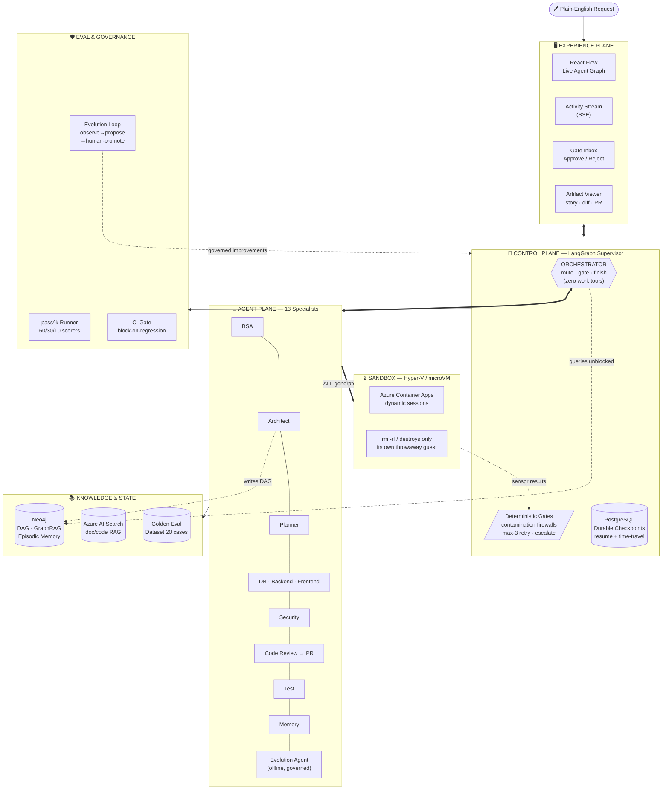

<div align="center">

<br/>

```
 ██████╗ ██████╗ ███╗   ██╗████████╗██╗███╗   ██╗██╗   ██╗██╗   ██╗███╗   ███╗
██╔════╝██╔═══██╗████╗  ██║╚══██╔══╝██║████╗  ██║██║   ██║██║   ██║████╗ ████║
██║     ██║   ██║██╔██╗ ██║   ██║   ██║██╔██╗ ██║██║   ██║██║   ██║██╔████╔██║
██║     ██║   ██║██║╚██╗██║   ██║   ██║██║╚██╗██║██║   ██║██║   ██║██║╚██╔╝██║
╚██████╗╚██████╔╝██║ ╚████║   ██║   ██║██║ ╚████║╚██████╔╝╚██████╔╝██║ ╚═╝ ██║
 ╚═════╝ ╚═════╝ ╚═╝  ╚═══╝   ╚═╝   ╚═╝╚═╝  ╚═══╝ ╚═════╝  ╚═════╝ ╚═╝     ╚═╝
```

### *Agentic SDLC Pipeline — Enterprise POC*

**Plain-English feature request in. Merge-ready PR out.**

<br/>

[](https://python.org)
[](https://github.com/langchain-ai/langgraph)
[](https://azure.microsoft.com/en-us/products/ai-studio)
[](https://neo4j.com)
[](https://react.dev)
[](https://fastapi.tiangolo.com)

<br/>

[]()
[]()
[]()
[]()
[]()
[]()
[]()

</div>

---

## ⚡ What Is This?

Continuum is an **enterprise-grade agentic SDLC pipeline** built on a LangGraph supervisor pattern. It takes a single plain-English feature request and routes it through a swarm of 13 specialized AI agents — business analyst, architect, three parallel dev agents, security scanner, code reviewer, and more — each doing one job and handing control back to a central orchestrator.

Every stage is a deterministic gate. Every line of generated code runs in a Hyper-V sandbox. The pipeline learns from every run via Neo4j episodic memory. And it measures its own reliability with `pass^k` — not just `pass@k`.

> **The pipeline is the product, not the LLM.** Models are tiered and swappable. The harness is what we optimize.

---

## 🔄 The Pipeline

```
┌─────────────────────────────────────────────────────────────────────────────┐
│                                                                             │
│   "Add a products listing page with search and filters"                     │
│                              │                                              │
│                              ▼                                              │
│                    ┌─────────────────┐                                      │
│                    │  ORCHESTRATOR   │  ← no work tools, only routes        │
│                    │  (LangGraph)    │                                      │
│                    └────────┬────────┘                                      │
│                             │                                               │
│         ┌───────────────────┼────────────────────┐                         │
│         ▼                   ▼                    ▼                         │
│   ┌──────────┐       ┌──────────────┐    ┌──────────────┐                  │
│   │   BSA    │       │  ARCHITECT   │    │   PLANNER    │                  │
│   │ story+AC │  ───► │ contract+    │ ──►│ DAG→tasks    │                  │
│   │ → ADO    │       │ schema+DAG   │    │ via Neo4j    │                  │
│   └──────────┘       └──────────────┘    └──────┬───────┘                  │
│                                                  │                         │
│              ┌───────────────┬──────────────────┐│                         │
│              ▼               ▼                  ▼▼                         │
│       ┌──────────┐   ┌──────────┐      ┌──────────────┐                   │
│       │ DATABASE │   │ BACKEND  │      │  FRONTEND    │                    │
│       │migrations│   │FastAPI + │      │ Next.js 14 + │                   │
│       │   DDL    │   │SQLAlchemy│      │  shadcn/ui   │                   │
│       └────┬─────┘   └────┬─────┘      └──────┬───────┘                   │
│            └──────────────┴───────────────────-┘                          │
│                              │                                              │
│                    ┌─────────▼────────┐                                    │
│                    │  GATE: local     │  lint + type + test + build        │
│                    │  verify (max 3)  │  ← same image as CI (Rule 3)       │
│                    └─────────┬────────┘                                    │
│                              │ green                                       │
│                    ┌─────────▼────────┐                                    │
│                    │    SECURITY      │  SAST + secrets + CVE scan         │
│                    │  (mandatory)     │                                    │
│                    └─────────┬────────┘                                    │
│                              │                                              │
│                    ┌─────────▼────────┐                                    │
│                    │  CODE REVIEW     │  raises PR in Azure DevOps         │
│                    │  + PR REVIEW     │                                    │
│                    └─────────┬────────┘                                    │
│                              │                                              │
│                    ┌─────────▼────────┐                                    │
│                    │     TEST         │  gen + run + coverage              │
│                    │   AGENT          │                                    │
│                    └─────────┬────────┘                                    │
│                              │                                              │
│                    ┌─────────▼────────┐                                    │
│                    │    MEMORY        │  writes episodes → Neo4j           │
│                    │    AGENT         │  run N+1 learns from run N         │
│                    └─────────┬────────┘                                    │
│                              │                                              │
│              ╔═══════════════▼══════════════════╗                          │
│              ║  ✅  MERGE-READY PULL REQUEST     ║                          │
│              ║  Story · Design · Code · Tests    ║                          │
│              ║  SAST clean · PR in Azure DevOps  ║                          │
│              ╚══════════════════════════════════╝                          │
└─────────────────────────────────────────────────────────────────────────────┘
```

---

## 🏗️ System Architecture



---

## 🤖 Agent Roster

| # | Agent | Responsibility | Model Tier | Milestone |
|---|-------|---------------|------------|-----------|
| 0 | **Orchestrator** | Route · gate · finish. Zero work tools. | Strong | M0 |
| 1 | **BSA** | Request → User Story + AC → Azure DevOps | Strong | M0 |
| 2 | **Architect** | Story → OpenAPI contract + DDL schema + task DAG | Strong | M0 |
| 3 | **Planner** | DAG → ordered task checklist via Neo4j | Cheap | M0 |
| 4 | **Database** | SQL migrations + seed data + RLS policies | Cheap | M1 |
| 5 | **Backend** | FastAPI + SQLAlchemy — implements every contract endpoint | Strong | M1 |
| 6 | **Frontend** | Next.js 14 + shadcn/ui — consumes the contract | Strong | M1 |
| 7 | **Security** | SAST · secrets · CVE scan (mandatory, non-skippable) | Strong | M1 |
| 8 | **Code Review** | Reviews diff · raises PR via Azure DevOps MCP | Strong | M1 |
| 9 | **PR Review** | Approve / request-changes loop | Strong | M1 |
| 10 | **Test** | gen_tests + run_tests + 80% coverage gate | Cheap | M1 |
| 11 | **Memory** | Writes episodes + entities → Neo4j after every run | Cheap | M3 |
| 12 | **Evolution Agent** | Observe → diagnose → propose harness edits (offline, governed) | Strong | M5 |

> Every agent returns a summary string to the orchestrator — never a transcript. Agents with code execution run **only** inside Hyper-V sandboxes.

---

## 📋 The 9 Rules (enforced in code, not a wiki)

| # | Rule | How Continuum enforces it |
|---|------|--------------------------|
| 1 | **Never push and pray** | Dev agents run the local CI mirror before any push; CI is confirmation, not discovery |
| 2 | **Every stage is a gate** | Conditional edges in the LangGraph graph — no skip paths exist |
| 3 | **Verify locally what CI verifies remotely** | `harness/ci-mirror.Dockerfile` — identical toolchain locally and in Azure Pipelines |
| 4 | **Bound the auto-fix loop** | Max 3 retries per gate on `GateStatus.retry_count` → escalate to human |
| 5 | **Skills are atoms, not prompts** | Every capability is a versioned function: `raise_pr@1.0`, `run_sast@1.0`, etc. |
| 6 | **Production deploys are retags** | Foundry/ADO promotion gates — same image from staging to prod, never rebuilt |
| 7 | **The pipeline is the product** | Harness versioned in git, models are swappable config — optimize the graph |
| 8 | **Plans are contracts** *(v2.2)* | Every BSA/Architect/Planner output is a machine-checked PEV contract |
| 9 | **The harness is governed** *(v2.2)* | Evolution Agent proposals require `human_promote()` — zero auto-apply paths |

---

## 🛡️ Security Model

```
┌─────────────────────────────────────────────────────────────────┐
│                    PERMISSION TIERS                              │
│                                                                  │
│  Tier 1: READ-ONLY     ─── All agents (query Neo4j, read repo)  │
│                                                                  │
│  Tier 2: SANDBOX-EDIT  ─── Dev/Test agents (patch files,        │
│                             run builds ONLY inside microVM)      │
│                                                                  │
│  Tier 3: FULL-ACCESS   ─── ADO writes, deploy, credentials      │
│              │                                                   │
│              └──► MANDATORY human interrupt() gate              │
│                   (LangGraph durable pause/resume)              │
└─────────────────────────────────────────────────────────────────┘

KEY INVARIANT: The sandbox isolates model-generated CODE.
               Credentialed host tools stay approval-gated.
               Broadening sandbox scope to reach them is FORBIDDEN.
```

**Why sandboxes matter:** Git-worktrees are a *correctness* boundary — they prevent parallel agents from corrupting each other's trees. They are **not** a security boundary. Nothing in a worktree stops agent code from reading credentials or calling the network. The Hyper-V sandbox is what does.

---

## 📊 Eval Harness

Continuum measures **reliability, not just capability.**

```
pass@k  = ≥1 success in k tries   (capability — inflates with k)
pass^k  = ALL k succeed            (reliability — the real bar)

Example: 70%-per-trial agent
  pass@3 = 97%   ← looks great
  pass^3 = 34%   ← the honest number
```

**Scorer mix** (20 golden cases, 3 tiers: simple / medium / complex):

| Layer | Weight | What it scores | Needs credentials? |
|-------|--------|---------------|--------------------|
| Deterministic | ~60% | `contract_valid`, `sast_clean`, `story_has_ac`, `dag_has_tasks`, `code_has_files`, `schema_has_tables` | ❌ No |
| LLM Judge | ~30% | BSA story quality (1–5 rating), heuristic fallback offline | Optional |
| Human Queue | ~10% | Items where judge and deterministic disagree ≥25pp | Manual |

**CI Gate:** first run writes `evals/results/baseline.json`; subsequent runs exit 1 if any metric regresses >2pp. Proven: artificially inflate baseline by 15pp → `exit 1`. Restore → `exit 0`.

---

## 🧠 The Learning Loop (M3)

```
Run 1:  BSA creates story → Architect writes contract → ... → Memory agent
        writes Episode node to Neo4j {decision, outcome, request_text}

Run 2:  BSA calls graphrag_query() FIRST
        └─► Neo4j fulltext search returns episode from run 1 (score=1.0)
        └─► BSA grounds new story on past decisions
        └─► Fewer mistakes, lower retry counts

Proven in scripts/verify_m3_learning.py → 6/6 PASS
```

---

## 🔬 Evolution Agent (M5)

The harness improves itself — under strict human control.

```
observe()   ─── read event-bus history across all runs
    │           identify: failure_rate, gate failures, retry patterns
    │
diagnose()  ─── classify: prompt_issue | gate_too_strict | skill_gap | routing_error
    │
propose()   ─── generate concrete diff: {file, before, after, rationale}
    │           write to evolution/proposals/pending/
    │
evaluate()  ─── run evals/ci_gate.py against modified harness copy
    │           return {improved, delta_pp, safe}
    │           REJECT if any metric regresses
    │
human_promote()  ←── THE ONLY CODE PATH THAT TOUCHES THE HARNESS
    │               runs verify-offline before applying
    │               moves proposal to applied/ or rejected/
    ▼
Change is live. Governed. Auditable. Reversible.
```

> Rule 9: **No proposal is ever auto-applied.** `human_promote()` is the single gate. The Evolution Agent is itself subject to the PEV loop.

---

## 🗂️ Work Queue & Evidence Stack (M6)

The UI becomes a **multi-run triage console**, and every run carries a cost +
lead-time and a 6-layer proof of merge-readiness.

```
run_status lifecycle:  running → waiting_gate → blocked / returned → done / failed
                                       │             │
                          local_verify red ×3    human returns a
                          → BLOCKED (escalate)   story/design gate
                                                 → RETURNED (with reason)

Evidence Stack (independent ground truth, per run):
  1. Build / compile        ← local_verify (ruff + mypy + py_compile)
  2. Regression suite       ← local_verify (pytest)
  3. Acceptance-criteria    ← contract_validate
  4. Scope conformance      ← stub today; wired to mapping fidelity in M7
  5. Lint + secret scan     ← security_sast
  6. Human review           ← story / design / merge approvals
```

- **Work Queue** (`ui/src/components/WorkQueue.tsx`) — "Waiting on you" vs "All
  runs", each row a status badge + cost + lead-time.
- **Spine** (`Spine.tsx`) — per-run vertical stage tracker; the AgentGraph stays
  as a secondary engineer view.
- **Blocked / Returned** panels — failing-gate sensor output with a
  "Send back to Implementation" action, or the rejection reason.
- **Evidence Stack + Run Metrics** — First-pass · Lead time · Model cost.
- **Cost accounting** — `state.cost_usd` accrues per agent (fixed estimate
  offline, token-priced when a live model is used); always populated.

New API: `POST /run/{id}/reject` · `POST /run/{id}/escalate-resolve` ·
`GET /runs/{id}/evidence`. New events: `run_blocked` · `run_returned`.
Proven offline in `scripts/verify_m6_workqueue.py` → 6/6 PASS.

---

## 🏆 Milestone Timeline

```
M0 ──── Walking skeleton · agent core · gates · Neo4j DAG · sandbox
  │     PR #0  ✅  11/11 + 3/3 PASS
  │
M1 ──── Live LLM · real skills · parallel DB→BE→FE · ADO integration
  │     PR #1  ✅  human interrupt() gates · resume endpoint
  │
M2 ──── React Flow live graph · SSE event stream · Gate inbox
  │     PR #4  ✅  Artifact viewer · history replay · dark UI
  │
M3 ──── Neo4j episodic memory · GraphRAG grounding · Memory agent
  │     PR #6  ✅  6/6 learning lift · run N+1 better than run N
  │
M4 ──── pass^k runner · 20 golden cases · CI regression gate
  │     PR #7  ✅  60/30/10 scorer mix · block-on-2pp regression
  │
M5 ──── Evolution Agent · bounded dynamic decomposition
  │     PR #8  ✅  observe→propose→human-promote · 6/6 PASS
  │
M6 ──── Work Queue UI · 6-layer Evidence Stack · run metrics
        ✅  run_status lifecycle · cost + lead-time · blocked/returned · 6/6 PASS
```

---

## ⚡ Quick Start

### Prerequisites
- Docker Desktop (for Neo4j + Postgres)
- Python 3.10+
- Node.js 18+ (for UI build)

### Offline demo (no Azure credentials needed)

```bash
git clone https://github.com/KIRTIRAJ4327/continuum
cd continuum

# 1. Install Python dependencies
pip install -r requirements.txt

# 2. Configure environment
cp .env.example .env
# Minimum for offline demo — no Azure needed:
#   NEO4J_PASSWORD=continuum-dev  (already set in .env.example)

# 3. Start Neo4j + Postgres
make services

# 4. Check what's configured
make check-env

# 5. Build UI + start API
make run
# → Open http://localhost:8000
```

### With live Azure AI Foundry (full path)

```bash
# Add to .env:
AZURE_OPENAI_API_KEY=your_key
AZURE_OPENAI_ENDPOINT=https://your-instance.openai.azure.com/
AZURE_DEPLOYMENT_STRONG=gpt-4o
AZURE_DEPLOYMENT_CHEAP=gpt-4o-mini
AZURE_DEVOPS_ORG=https://dev.azure.com/your-org
AZURE_DEVOPS_PROJECT=your-project
AZURE_DEVOPS_TOKEN=your_pat
AZURE_DEVOPS_REPO=your-repo

make run
```

### Submit your first feature request

```bash
curl -X POST http://localhost:8000/run \
  -H "Content-Type: application/json" \
  -d '{"request": "Add a products listing page with search and filters"}'

# Returns immediately with run_id
# Watch the React Flow graph at http://localhost:8000 — nodes light up in real time
# Human gates appear in the Gate Inbox
# Click any agent node to see its artifact
```

---

## 🧪 Verification Matrix

```bash
make verify-offline   # agent core + loop termination
make verify-m3        # learning lift (run N+1 > run N)
make verify-m4        # eval CI gate (regression blocking)
make verify-m5        # evolution agent (governed harness mutation)
make verify-m6        # work queue + evidence stack + run metrics
```

| Script | Checks | Result |
|--------|--------|--------|
| `scripts/verify_agent_core.py` | BSA/Arch/Planner/Dev/Security offline | 11/11 ✅ |
| `scripts/verify_m0_loop.py` | green path · red-then-green · persistent-red | 3/3 ✅ |
| `scripts/verify_m3_learning.py` | episode write · retrieval · score=1.0 | 6/6 ✅ |
| `evals/ci_gate.py` | stable vs baseline · regression detection | PASS ✅ |
| `scripts/verify_m5_evolution.py` | observe · diagnose · propose · eval · promote | 6/6 ✅ |
| `scripts/verify_m6_workqueue.py` | cost accrual · run_status · reject · blocked · evidence | 6/6 ✅ |

> All 6 suites pass with **zero external credentials** — Azure, Neo4j, and ADO are optional. Missing credentials activate the deterministic offline path automatically.

---

## 🛠️ Tech Stack

| Layer | Technology | Why |
|-------|-----------|-----|
| **Orchestration** | LangGraph 1.x (supervisor pattern) | Deterministic graph, `interrupt()` for human gates, durable checkpoints |
| **Models** | Azure AI Foundry — `AzureChatCompletions` | Tiered: cheap reasoning + strong codegen, managed identity |
| **Graph / Memory** | Neo4j 5.15 | DAG scheduler + GraphRAG + episodic memory in one database |
| **Checkpoints** | PostgreSQL via `AsyncPostgresSaver` | LangGraph durable execution, resume + time-travel |
| **Sandbox** | Azure Container Apps dynamic sessions | Hyper-V isolated, GA, $0.03/session-hr |
| **DevOps** | Azure DevOps Remote MCP Server | Work items · PRs · Pipelines · Wiki via Entra auth |
| **Doc RAG** | Azure AI Search | Hybrid vector + keyword over standards and past PRDs |
| **UI** | React 18 + React Flow + Tailwind + SSE | Live DAG graph, activity stream, gate inbox |
| **API** | FastAPI 0.115+ async | SSE event stream, artifact viewer, resume endpoint |
| **CI** | harness/ci-mirror.Dockerfile | Local == CI — same toolchain, drift = P0 |
| **Evals** | Custom pass^k runner + LangSmith | Reliability measurement, block-on-regression gate |

---

## 📁 Repository Structure

```
continuum/
├── orchestrator/          # LangGraph supervisor · routing · retry counters
│   ├── graph.py           #   full graph with interrupt() human gates
│   ├── agent_runner.py    #   LLM + offline execution · tool binding
│   ├── gates.py           #   ruff · mypy · pytest · bandit · OpenAPI validator
│   ├── state.py           #   ContinuumState · GateStatus · AgentRole enum
│   ├── events.py          #   in-memory SSE event bus with history replay
│   └── decomposer.py      #   dynamic fan-out for DAGs >= 5 tasks
├── agents/                # YAML spec per agent (instructions · skills · tier)
├── skills/                # versioned atoms — skills/{name}/v1.0/skill.py
├── harness/               # PEV loop · sensors · permissions · ci-mirror.Dockerfile
├── sandbox/               # Azure Container Apps dynamic sessions client
├── graph_db/              # Neo4j driver · schema · Cypher queries · episode store
├── evals/                 # golden dataset · scorers · pass^k runner · CI gate
│   ├── golden/            #   20 feature requests + structural labels
│   ├── scorers/           #   deterministic (60%) · judge (30%) · human (10%)
│   ├── pass_k_runner.py   #   k-trial reliability measurement
│   ├── evidence_stack.py  #   M6: 6-layer merge-readiness proof (pure/offline)
│   └── ci_gate.py         #   baseline-compare → exit 1 on regression
├── evolution/             # Evolution Agent (governed harness mutation)
│   ├── agent.py           #   observe → diagnose → propose
│   ├── evaluator.py       #   eval against CI suite before applying
│   └── promoter.py        #   human_promote() — the ONLY apply path
├── integrations/          # Azure DevOps MCP · web research
├── ui/                    # React 18 + React Flow + Tailwind + Vite
│   └── src/components/    #   WorkQueue · Spine · AgentGraph · ActivityStream
│                          #   GateInbox · ArtifactViewer · EvidenceStack · RunMetrics
├── api/                   # FastAPI: /run · /events (SSE) · /artifacts · /resume
│                          #   M6: /reject · /escalate-resolve · /runs/{id}/evidence
├── scripts/               # Verification scripts for each milestone
├── docker-compose.yml     # Neo4j 5.15 + Postgres 15
└── Makefile               # make run · make services · make verify-* · make evo-*
```

---

## 📖 Documentation

| Document | Description |
|----------|-------------|
| [`Continuum-Agentic-SDLC-PRD.md`](./Continuum-Agentic-SDLC-PRD.md) | Full PRD v2.2 — architecture decisions, 9 rules, PEV model, 3-tier permissions, eval harness spec |
| [`Continuum-Architecture.mermaid`](./Continuum-Architecture.mermaid) | System architecture diagram — 7 planes |
| [`Continuum-Research-Report.md`](./Continuum-Research-Report.md) | Research backing — 5 sources: Hyperlight, dynamic workflows, Code as Agent Harness, Princeton HAL, 2026 eval literature |
| [`CROSS-VALIDATION.md`](./CROSS-VALIDATION.md) | PRD vs implementation gap analysis |
| [`Claude-Code-Handoff.md`](./Claude-Code-Handoff.md) | M0 brief for Claude Code |

---

## 🔑 Makefile Reference

```bash
make services         # start Neo4j + Postgres (Docker)
make services-down    # stop services
make run              # build UI + start FastAPI on :8000
make run-dev          # FastAPI only (no UI build)
make ui-dev           # Vite dev server on :5173 with proxy
make install          # pip install -r requirements.txt
make check-env        # audit which env vars are set
make verify           # lint + type + unit tests
make verify-offline   # 11/11 + 3/3 agent + loop tests
make verify-m3        # 6/6 learning lift demo
make verify-m4        # eval CI gate
make verify-m5        # 6/6 evolution agent demo
make verify-m6        # 6/6 work queue + evidence stack demo
make eval-baseline    # run full eval suite, write baseline
make eval-ci          # fast CI check (5 cases)
make eval-report      # full pass^k report (20 cases, k=5)
make evo-observe      # print current failure patterns
make evo-propose      # generate + evaluate a harness proposal
make evo-promote      # list pending proposals, apply selected
```

---

<div align="center">

**Built on the Continuum Framework**

*A plain-English request enters. A supervised swarm of agents carries it through the entire SDLC.*
*Deterministic gates. Hardware-isolated sandboxes. A pipeline that learns.*

[](https://github.com/KIRTIRAJ4327/continuum)
[](./Continuum-Agentic-SDLC-PRD.md)
[](./Continuum-Research-Report.md)

</div>
